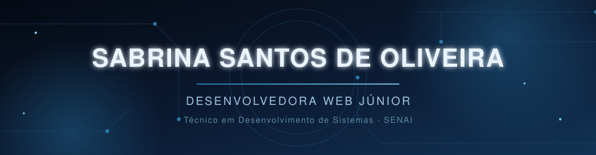
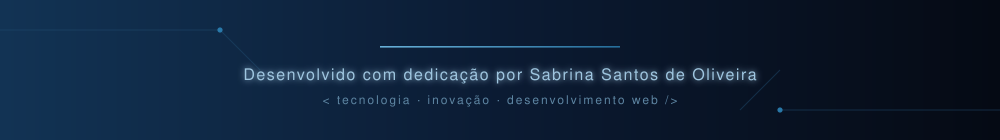

<div align="center">
  
</div>

<div align="center">


</div>


## 🧠 Sobre mim

```yaml
Desenvolvedora: Sabrina Santos de Oliveira
Formacao: "Técnico em Desenvolvimento de Sistemas — SENAI"
Interesses:
  - Desenvolvimento Web
  - Programação
  - Tecnologia
  - Inovação
  - Criação de soluções digitais
```

<p>
Sou formada em <strong>Técnico em Desenvolvimento de Sistemas</strong> pelo <strong>SENAI</strong> e estou em busca de oportunidades como <strong>Desenvolvedora Web Júnior</strong>. Gosto de transformar ideias em soluções digitais funcionais, unindo lógica, boas práticas e atenção ao design. Curiosa por tecnologia e sempre em evolução constante.
</p>


## ⚙️ Tecnologias e Ferramentas

<p align="center">
  
  
  
  
  
  
  
  
  
</p>

### 💡 Diferenciais & Soft Skills
* **Resolução de Problemas:** Foco em criar códigos limpos, funcionais e de fácil manutenção.
* **Aprendizado Contínuo:** Facilidade de assimilação de novas linguagens e frameworks.
* **Trabalho em Equipe:** Comunicação clara, proatividade e abertura para feedback.


## 🚀 Projetos em destaque

<table width="100%">
  <tr>
    <td width="50%" valign="top">
      <h3>📚 Lumos Livraria</h3>
      <p>Sistema web interativo desenvolvido com <strong>Flask</strong>, <strong>Front-End</strong>, <strong>Back-End</strong> e <strong>SQLite</strong>. Aplicação Full-Stack com gerenciamento de dados e interface responsiva.</p>
      <a href="https://github.com/sasasantos/lumos_livraria">
        
      </a>
    </td>
    <td width="50%" valign="top">
      <h3>🌐 Portfólio Pessoal</h3>
      <p>Site desenvolvido para consolidar meus principais projetos, habilidades técnicas e jornada de aprendizado na área da tecnologia.</p>
      <a href="https://github.com/sasasantos/portfolio">
        
      </a>
    </td>
  </tr>
</table>


## 🔗 Contatos e links

<p align="center">
  <a href="https://github.com/sasasantos">
    
  </a>
  <a href="https://www.linkedin.com/in/sabrina-santos-de-oliveira-33b5073b0/">
    
  </a>
  <a href="https://github.com/sasasantos/portfolio">
    
  </a>
  <a href="mailto:Sabrinasantosoliveira82@gmail.com">
    
  </a>
</p>

<div align="center">
  
</div>
