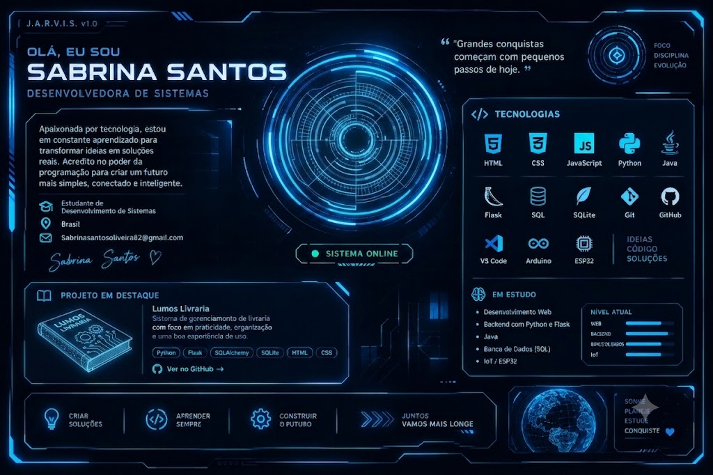

  <!-- BANNER PRINCIPAL (Sua imagem futurista) -->
  

    

  <!-- STATUS EM DIGITAÇÃO -->
  

   

  <!-- BADGES DE CONTATO -->
  
  

 

---

### ⚡ Sobre Mim

> **"Grandes conquistas começam com pequenos passos de today."**

Sou estudante de Desenvolvimento de Sistemas, apaixonada por automação, desenvolvimento backend e IoT. Meu foco é criar soluções simples, eficientes e inteligentes.

* 🔭 **Projetos Atuais:** Sistemas Web em Python e Flask.
* 🌱 **Estudando:** Banco de Dados Relacional (SQL), IoT com ESP32/Arduino e Java.
* 📍 **Localização:** Brasil.

---

### 🛠️ Tecnologias & Ferramentas

  
  
  
  
  
  
  
  

---

### 🚀 Destaque // Lumos Livraria

Sistema de gerenciamento para livrarias com foco na usabilidade, organização de acervo e fluxo rápido.

* **Linguagens/Frameworks:** Python, Flask, SQLAlchemy, SQLite, HTML e CSS.
* 🔗 [Acessar repositório da Lumos Livraria](https://github.com/sasasantos/lumos-livraria)

---

### 📊 Estatísticas

  
  

 

  <i>Sonhe • Planeje • Estude • Conquiste 💙</i>

